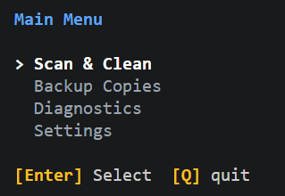
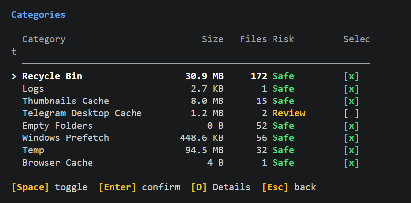

<div align="center">

# 🧹 broominal

**безопасная, прозрачная, отменяемая очистка windows из терминала**

[](https://go.dev)
[](https://github.com/elev1e1nSure/broominal/actions/workflows/ci.yml)
[](https://github.com/elev1e1nSure/broominal/releases)
[](LICENSE)
[](https://github.com/elev1e1nSure/broominal)

[english](README.md) · [русский](README.ru.md)

</div>

---

## Что это

**broominal** — CLI/TUI-утилита для очистки Windows, построенная вокруг одного правила:

> очистка должна быть **обратима**

Вместо безвозвратного удаления broominal перемещает выбранные файлы в локальный **карантин**, сохраняет JSON-манифесты и делает каждую очистку проверяемой и восстанавливаемой.

Без фейкового ускорения ПК и скрытых системных твиков. Без очистки на честном слове.





---

## Установка

```powershell
go install github.com/elev1e1nSure/broominal/cmd/broominal@latest
```

Или скачай последнюю `.exe` из [релизов][releases].

[releases]: https://github.com/elev1e1nSure/broominal/releases

<details>
<summary>Сборка из исходников</summary>

```powershell
git clone https://github.com/elev1e1nSure/broominal.git
cd broominal

go build -o broominal.exe ./cmd/broominal
.\broominal.exe ui
```

</details>

---

## Быстрый старт

Типичный путь: нашёл → посмотрел → почистил → откатил.

```powershell
# найти кандидатов на очистку
broominal scan

# посмотреть, что будет очищено (dry-run)
broominal clean --dry-run

# очистить безопасные элементы
broominal clean --safe

# что-то пошло не так? восстанови последнюю очистку
broominal restore latest
```

Для интерактивного режима запусти `broominal ui`.

---

## Модель безопасности

> **safe** очистка выбрана по умолчанию. **review** требует ручного выбора. Элементы **danger** никогда не чистятся автоматически.

```
┌─────────────────────────────────────────────────────────────┐
│  safe    ▸ выбрано по умолчанию                             │
│           temp, миниатюры, shader cache, кэши приложений    │
├─────────────────────────────────────────────────────────────┤
│  review  ▸ пользователь выбирает вручную                    │
│           downloads, дампы, Windows Update cache, Telegram  │
├─────────────────────────────────────────────────────────────┤
│  danger  ▸ никогда не чистится автоматически                │
│           системные пути, защищённые расширения             │
└─────────────────────────────────────────────────────────────┘
```

Файлы перемещаются в `%LOCALAPPDATA%\broominal\quarantine\<restore-id>` с `manifest.json`, где записано соответствие исходных путей и путей в карантине.

---

## Возможности

- **безопасно по умолчанию** — файлы отправляются в карантин, а не удаляются
- **прозрачно** — результаты сканирования, отчёты и манифесты — обычный JSON
- **отменяемо** — восстанови любую очистку по ID или верни последнюю
- **предсказуемо** — явные категории, уровни риска и исключения
- **интерактивно** — Bubbletea TUI для сканирования, предпросмотра и восстановления
- **мультиязычно** — русский и английский с автоопределением при первом запуске
- **25+ категорий** — temp, кэши, логи, данные браузеров, инструменты разработки и не только
- **doctor** — лёгкие проверки прав, манифестов и состояния карантина

---

## Команды

### scan

Просканируй систему в поисках кандидатов на очистку по 25+ категориям.

```powershell
broominal scan
```

Результаты сохраняются как JSON для прозрачности и могут быть проверены перед очисткой.

### clean

Очисти выбранные элементы. По умолчанию чистятся только элементы **safe**.

```powershell
# очистить только безопасные элементы (по умолчанию)
broominal clean

# разрешить очистку опасных элементов (требует явного подтверждения)
broominal clean --danger

# показать, что будет очищено, без реальной очистки
broominal clean --dry-run
```

### restore

Восстанови предыдущую очистку. Каждая очистка получает уникальный ID для восстановления.

```powershell
# восстановить конкретную очистку по ID
broominal restore <id>

# восстановить последнюю очистку
broominal restore latest

# восстановить с перезаписью, если файл уже существует
broominal restore <id> --force-overwrite
```

### ui

Запусти интерактивный TUI дляguided-очистки.

```powershell
broominal ui
```

TUI позволяет:
- Просматривать результаты сканирования по категориям
- Переключать элементы для очистки
- Предпросматривать общий размер перед очисткой
- Запускать в режиме dry-run для тестирования
- Интерактивно обрабатывать конфликты при восстановлении

### doctor

Запусти проверки состояния для верификации работы broominal.

```powershell
broominal doctor
```

Проверяется:
- Права администратора
- Доступ к директориям
- Целостность манифестов
- Статистика карантина

### config

Посмотреть и изменить конфигурацию.

```powershell
# показать текущий конфиг
broominal config

# редактировать конфиг в редакторе по умолчанию
broominal config --edit
```

Параметры конфига:
- Включённые категории
- Пороги возраста/размера
- Исключения
- Переопределения рисков
- Язык
- Максимальный возраст карантина

### quarantine-cleanup

Очистить старые карантины для освобождения места.

```powershell
# предпросмотр очистки старых карантинов (покажет, что будет удалено)
broominal quarantine-cleanup

# удалить карантины старше 30 дней
broominal quarantine-cleanup --force

# удалить карантины старше N дней
broominal quarantine-cleanup --max-age-days 7 --force
```

### report

Сгенерировать отчёт об очистке из последнего сканирования.

```powershell
# сгенерировать отчёт из последнего сканирования
broominal report
```

Отчёт сохраняется в формате JSON и включает результаты сканирования и статистику очистки.

---

## Конфигурация

Можно настроить поведение broominal через флаги.

```powershell
# сканировать с кастомным путём к конфигу
broominal scan --config "C:\path\to\config.json"

# очистить с конкретными включёнными категориями
broominal clean --categories "temp,cache,logs"

# запустить в подробном режиме
broominal scan --verbose
```

Конфиг-файл (`%APPDATA%\broominal\config.json`):

```json
{
  "enabledCategories": ["temp", "thumbnails", "logs"],
  "oldInstallerMonths": 6,
  "largeFileMinSizeMb": 100,
  "largeFileMonths": 6,
  "oldTempDays": 7,
  "oldExtensionDays": 30,
  "exclusions": [],
  "autoRiskOverrides": {},
  "language": "ru",
  "quarantineMaxAgeDays": 30
}
```

---

## Архитектура

```
cmd/broominal/   точка входа CLI (Cobra)

pkg/
  scanner/       поиск файлов по категориям очистки
  cleaner/       перемещение в карантин и сохранение отчёта
  quarantine/    перемещение, восстановление, очистка, JSON-манифесты
  report/        генерация JSON-отчётов
  risk/          классификация риска по путям, расширениям и конфигу
  config/        JSON-конфигурация и значения по умолчанию
  doctor/        проверки состояния окружения
  i18n/          русская/английская локализация
  style/         ANSI-цвета для CLI-вывода
  util/          форматирование размеров и общие helpers
  types/         общие доменные типы

internal/
  tui/           интерактивный интерфейс на Bubbletea
```

---

## Философия

broominal специально скучный. Он не обещает чудесную оптимизацию, магию реестра или «ускорение в один клик». Он находит кандидатов на очистку, классифицирует риск, показывает результат и перемещает выбранные файлы в карантин, чтобы операцию можно было отменить.

Маленькие пакеты. Явные зоны ответственности. Никакой скрытой магии очистки.

---

## Разработка

> Включи общие githooks перед коммитами:
> ```powershell
> git config core.hooksPath githooks
> ```

**Хуки**
- `pre-commit` — предупреждает, если изменения кода могут требовать обновления документации
- `commit-msg` — проверяет conventional commits

**CI на каждый push / PR в `main`**
```
gofmt → go vet → golangci-lint → go test ./... → сборка Windows-артефакта
```

**Релиз**
```
git-cliff → сборка broominal.exe → подписанный тег → GitHub release + checksums
```

---

## Участие

Баг-репорты, идеи новых категорий очистки, улучшения безопасности и странные Windows edge cases приветствуются.

См. [CONTRIBUTING.md](CONTRIBUTING.md).

---

## Лицензия

[MIT](LICENSE) © elev1e1nSure
